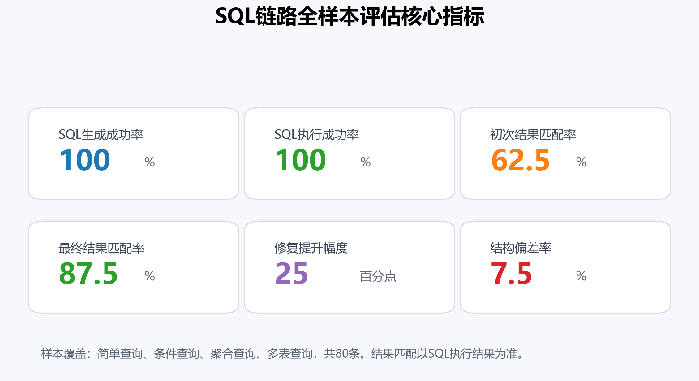
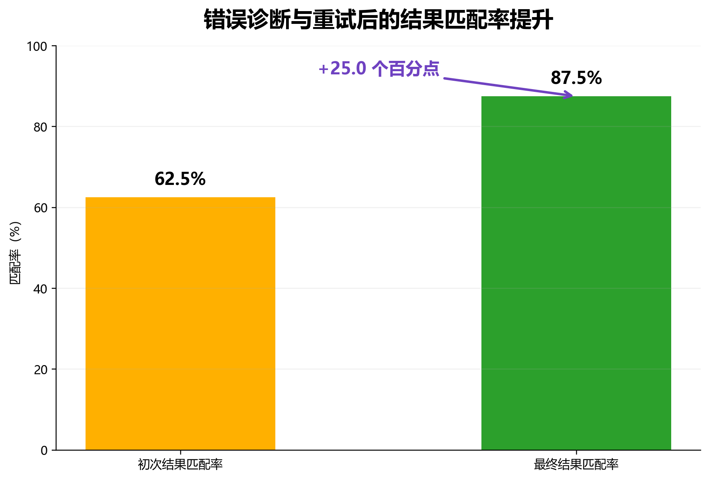
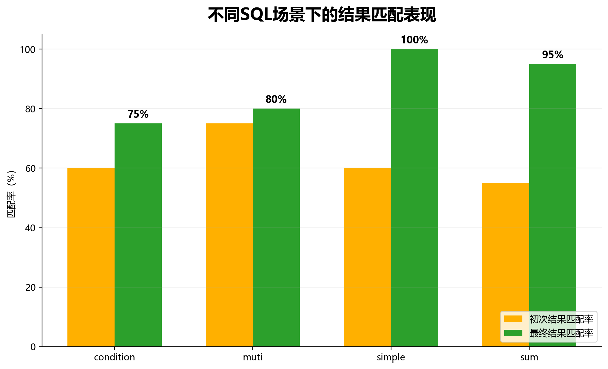
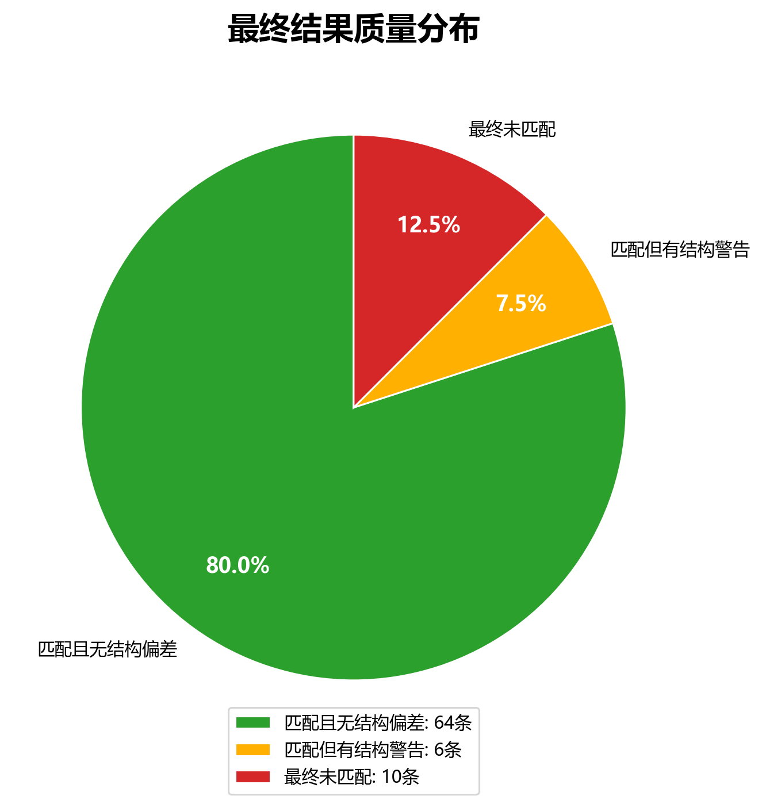
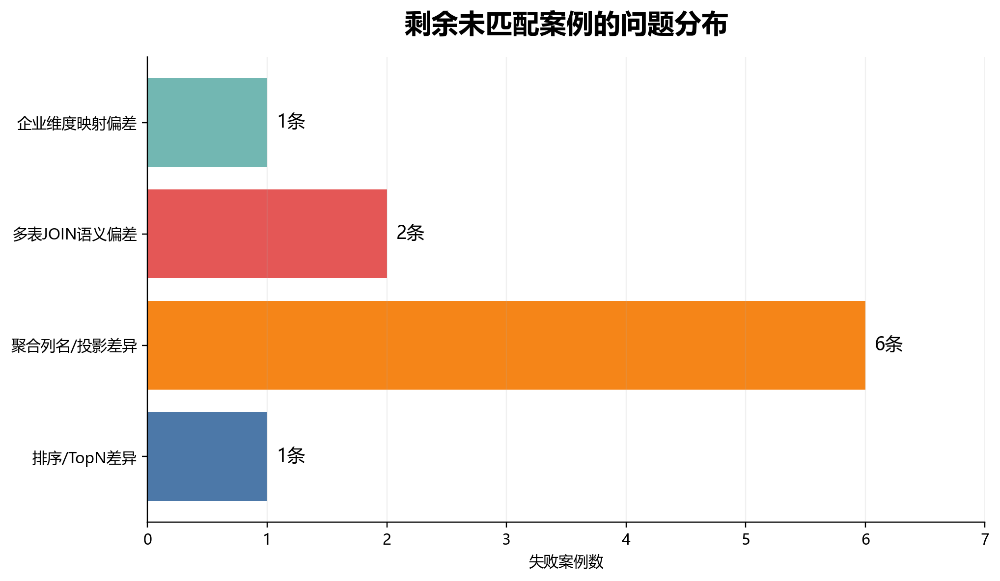

# SQL链路全样本评估图示说明

数据来源：`tests\sql_test\reports\all_samples_20260430_174723.json`

## 图示清单

### 01_kpi_cards.png

核心指标卡：适合放在评估结果首页。

### 02_accuracy_lift.png

匹配率提升图：突出从初次生成到最终修复后的提升幅度。

### 03_category_comparison.png

分类表现对比：展示简单、条件、聚合、多表场景的差异。

### 04_final_quality_donut.png

最终质量分布：区分无偏差匹配、有结构警告匹配、未匹配。

### 05_failure_reasons.png

剩余问题分布：说明后续优化方向。

