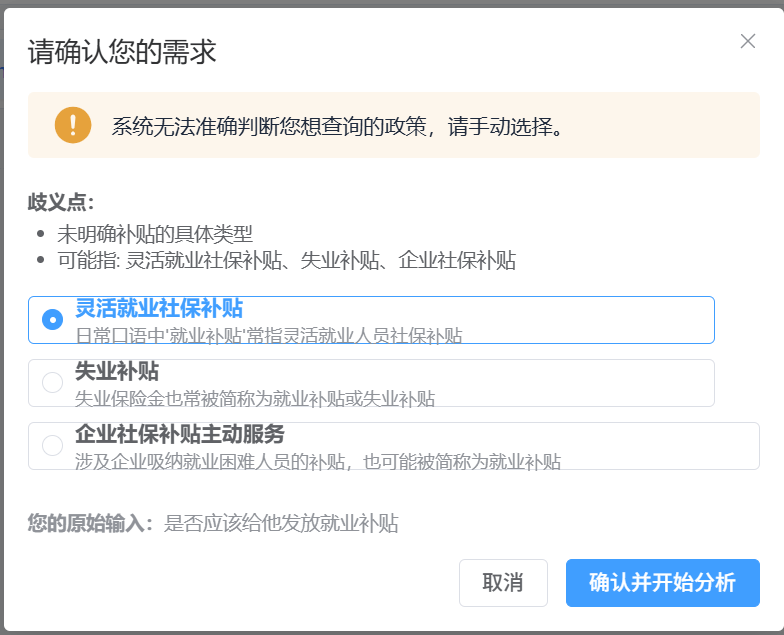

# 多政策扩展待办清单（Extension Todo）

> 项目：从「仅身份证号输入」升级为「身份证号 + 科员一句话需求」
> 最近更新：2026-03-25（已补充 `App.vue` 意图与双输入框联调记录）
> 执行原则：先打通“政策抽取与意图识别”主链路，再扩展政策路由与多政策取证

---

## ✅ 第二阶段：政策抽取链路联调（基本完成）

> 目标：把“代码已就位”推进到“可稳定产出政策 JSON”。

- [x] 跑通 `python scripts/parse_policies.py` 全流程（本地已能批处理 `docs/policy` 下 3 个源文件并写出 `policies/*.json`）
- [x] 三个政策源文件纳入批处理：
  - `POLICY_001_灵活就业社保补贴资格认定.txt`
  - `POLICY_002_灵活就业社保补贴月数计算.txt`
  - `POLICY_003_企业社会保险补贴主动服务（增员筛查）.txt`（以实际文件名为准）
- [ ] 对抽取结果做系统性字段级校验与人工抽检（`rule_id`、`policy_type`、`intent_patterns`、`evidence_plan_template` 等与业务预期对齐）

---

## ✅ 第三阶段：政策路由与接口接入（后端已完成；前端主流程已联调）

> 目标：将“身份证号 + 一句话需求”接入现有后端主链路。

### 3.1 政策路由

- [x] 实现 `policy/policy_router.py`
  - 从 `policies/*.json` 扫描加载并模块级缓存
  - 提供 `get_policy(policy_id)`、`list_policies()`、`reload_policies()`

### 3.2 FastAPI

- [x] `DebateRequest` 扩展：`user_query`（科员一句话）、`confirmed_policy_id`（用户二次确认后的政策）
- [x] 新增 `POST /api/intent` — 单独意图识别，供前端先预览再开辩
- [x] 新增 `GET /api/policies` — 已加载政策摘要列表
- [x] `POST /api/debate` 接入意图解析：高置信直连辩论；`need_confirmation` 时返回结构化意图，不启辩
- [x] `POST /api/debate_stream` 接入同一套解析；需二次确认时返回 **JSON**（非 SSE），便于前端分支处理
- [x] 未传 `user_query` 且未传 `confirmed_policy_id` 时 **向后兼容**：默认 `POLICY_001`

### 3.3 编排与证据投影

- [x] `DebateOrchestrator.run_debate` / `run_debate_stream` 增加 `policy_id`，并传入 `EvidencePlanner.plan(..., policy_id=...)`
- [x] `project_evidence` 支持按政策动态 `task_header` / `policy_scope`（来自 `PolicyConfig` 或兜底常量）

### 3.4 持久化与 Schema

- [x] `debate_persistence.build_completed_session_records` / `persist_completed_session` 增加 `policy_id`
- [x] 会话 **快照 JSON**（`snapshot_payload`）及 `summary` 中写入 `policy_id`
- [x] `list_saved_sessions` 查询与摘要返回中带 `policy_id`（便于历史列表按政策展示/筛选）
- [x] `data/schema/mysql_ddl.sql` 中 `debate_session` 增加 `policy_id` 列及索引（新库直接建表即含该列）

### 3.5 前端（主流程已完成；历史列表增强待办）

> **设计说明**：未新增 Vue Router、未与「视图一 / 二 / 三」并列新 Tab——意图与输入放在顶栏工具栏，与三视窗同页，避免割裂演示动线。

- [x] `frontend/src/App.vue` — **双输入框**：身份证号 + 一句话需求（占位提示科员口语场景）；Enter 均可触发分析
- [x] 有需求描述时先调 `POST /api/intent`；高置信在工具栏下展示 **意图提示条**（政策名、置信度、`reasoning`）
- [x] `need_confirmation` 时 **`el-dialog` 二次确认**：候选 `candidate_policies` 单选 → 确认后以 `confirmed_policy_id` 启动 `POST /api/debate_stream`
- [x] SSE 若收到 **`Content-Type: application/json`**（后端 `need_confirmation` 分支），同样弹窗处理，不误当流解析
- [x] `startStreamDebate` 请求体：`confirmed_policy_id` 优先；否则带 `user_query`；皆空则仅 `id_card`（**向后兼容**原单证件流程）
- [ ] **视图三** `HistorySessionList`：列表项展示 `policy_id` / 政策名称（后端 `GET /api/debates` 已带 `policy_id`，前端未渲染）
- [ ] （可选）按 `policy_id` 筛选历史、或调用 `GET /api/policies` 做政策说明侧栏

---

## 🔨 第四阶段：多政策落地（未开始）

> 目标：从当前单政策演进到多政策可运行。

- [ ] 失业补贴（独立 POLICY）取证规则与数据口径（若与现有灵活就业分政策建模）
- [ ] 主动服务（POLICY_003）与 `DynamicEvidenceCollector` / SQL 模板全链路对齐
- [ ] `DynamicEvidenceCollector` 按 `policy_id` **严格**切换取证清单（当前编排已传 `policy_id`，取证层策略待补强）
- [ ] 多政策端到端测试与回归测试补齐

---

## ✅ 本文件之外、实施过程中顺带完成的事项（额外记录）

> 以下内容最初未写在「扩展待办」分段里，但实际已做，便于追溯。

- [x] `policy/policy_parser_agent.py`：修复跨行 **f-string** 语法错误（日志中的规则数统计）
- [x] `policy_parser_agent.py` / `intent_understanding_agent.py`：改为使用项目既有 **`llm_chat()`**，替代不存在的 `get_llm_client`
- [x] 两处 Agent 增加 **`_extract_json`**，兼容模型返回带 markdown 代码块的 JSON
- [x] 删除误放入仓库的 **`policies/POLICY_001_灵活就业补贴.json`**（手写/重复产物；正式来源应为 `parse_policies` 生成）
- [x] **已有 MySQL 库升级**：`debate_session` 增加 `policy_id`（你已本地执行 `ALTER`；新环境仍可对齐 `mysql_ddl.sql`）

---

## ✅ 第一阶段：政策抽取与意图识别基础骨架（已完成）

> 目标：先把“可自动抽取政策规则”的代码骨架搭好，避免手工维护政策 JSON。

### 1.1 意图识别模块（intent）

- [x] 创建 `intent/__init__.py`
- [x] 创建 `intent/models.py`，定义：
  - `CandidatePolicy`
  - `PolicyIntent`
- [x] 创建 `intent/intent_understanding_agent.py`
  - 基于 `config.llm_client.llm_chat()` 调用模型
  - 支持结构化 JSON 解析
  - 支持 markdown 代码块 JSON 提取容错（`_extract_json`）
  - 支持低置信度场景的二次确认字段输出

### 1.2 政策解析模块（policy）

- [x] 创建 `policy/__init__.py`
- [x] 创建 `policy/policy_models.py`，定义：
  - `PolicyRule`
  - `StructuredRules`
  - `PolicyConfig`
- [x] 创建 `policy/policy_parser_agent.py`
  - 支持读取 `docs/policy/*.txt` 原始政策文件
  - 支持调用 LLM 进行规则抽取
  - 支持结构化 JSON 解析与容错（`_extract_json`）
  - 支持保存到 `policies/*.json`
  - 支持批量解析入口（`batch_parse_policies`）

### 1.3 执行脚本

- [x] 创建 `scripts/parse_policies.py`
  - 一次性批量解析 `docs/policy` 下政策源文件
  - 生成结构化政策配置到 `policies/`
  - 输出解析汇总日志

---

## 持续跟踪项

- [x] 每完成一个阶段，在本文件同步勾选并记录日期（2026-03-25 已同步前端）
- [ ] 与 `todolist.md` 保持状态一致（避免主线与扩展线偏差）
- [ ] 抽取失败样例沉淀到后续优化样本池（用于 Prompt/Few-shot 迭代）

修改内容：

  1. 导入 ToolRegistry（第 24 行）
  2. 初始化工具（第 126-127 行）：
  self.tool_registry = ToolRegistry()
  self.tools = self.tool_registry.get_tool_schemas()
  3. 传递工具给 Agent：
    - _run_round_zero() 第 264 行
    - _run_debate_round() 第 286-287 行
    - run_debate_stream() 第 198 行和第 216-220 行

  现在 Agent 可以在辩论过程中调用 text_to_sql 和 get_dict 工具动态查询数据库。